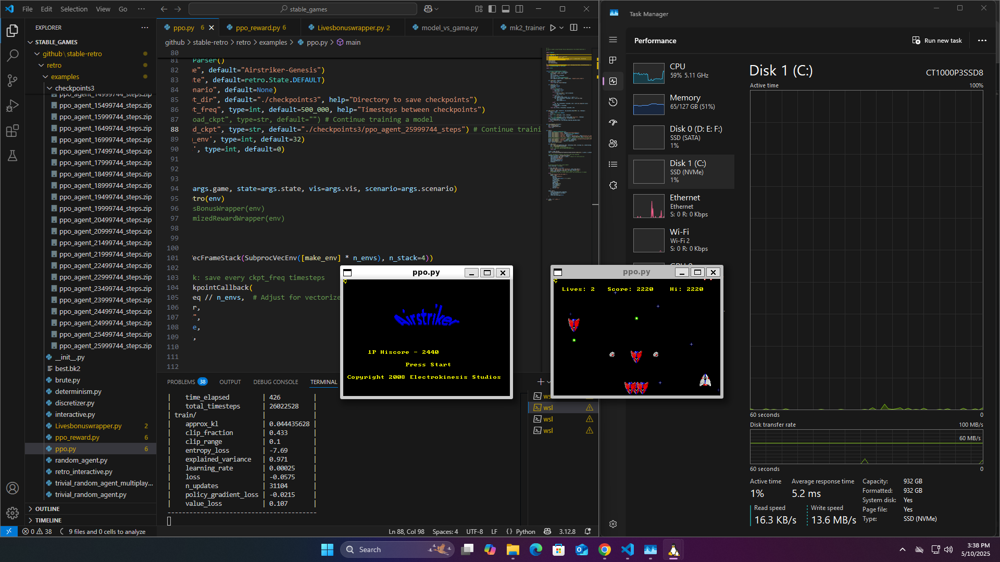
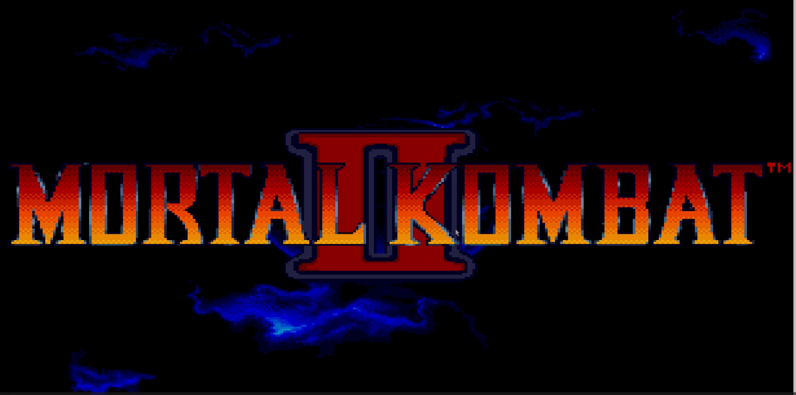
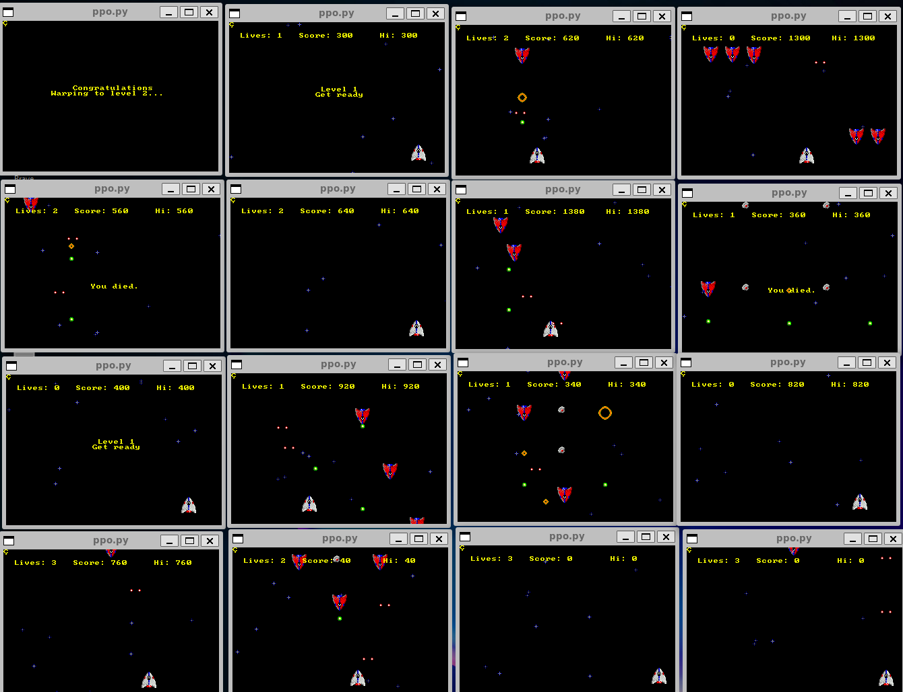
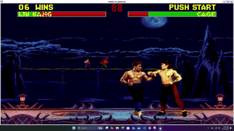
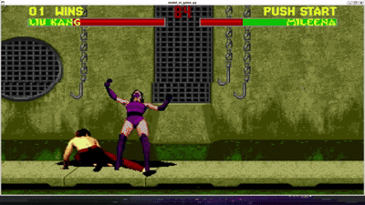

# Mortal-Kombat-X-AirStriker-Genesis

Airstriker Finishing           |  MORTAL KOMBAT II |  Airstriker Training
:-------------------------:|:-------------------------:|:-------------------------:
 |  | 

## Trained model [Liu kang]
Liu kang trained           |  Action Exploitation [Leg sweep]  
:-------------------------:|:-------------------------:
 |  

## Project Structure
```
Mortal-Kombat-X-AirStriker/
│
├── airstriker/         # AirStriker (Genesis) RL integration
│   ├── chekpoints
│   ├── ppo.py
│   └── ppo_play.py
│
├── mortal_kombat_2/    # Mortal Kombat II RL integration
│   ├── ckpt_subzero/
│   ├── game_wrappers/
│   ├── rom/
│   ├── commin.py
│   ├── envs.py
│   ├── export_model.py
│   ├── game_wrappers_mgr.py
│   ├── mk2_trainer.py
│   ├── model_trainer.py
│   ├── models.py
│   └── utils.py
│
├── LICENSE             # MIT License
└── README.md           # This documentation
```

## System installations
```
sudo apt update
sudo apt-get install python3 python3-pip git zlib1g-dev libopenmpi-dev ffmpeg cmake
```

## Virtual environment setup
```
sudo pip3 install -U virtualenv
virtualenv --system-site-packages -p python3 ~/vretro
source ~/vretro/bin/activate

git clone https://github.com/Farama-Foundation/stable-retro.git
cd stable-retro
pip3 install -e .

pip3 install "stable_baselines3[extra]" pygame torchsummary
```

## You can delete this newly cloned repo (Optional)
```
rm -rf stable-retro
```

## Project setup
```
git clone https://github.com/Swaroop3/Mortal-Kombat-X-AirStriker.git
cd Mortal-Kombat-X-AirStriker
```

## ROM installation
```
cd mortal_kombat_2
python3 -m retro.import ./rom
```

## MK2
```
python3 mk2_trainer.py                              # Train
python3 model_vs_game.py --state `statefilename`    # Play
```

## Airstriker
```
python3 ppo.py                                      # Train 
python3 ppo_play.py                                 # Play
```

## Misc info

*   Look inside the repective code for full arguments that can be used
*   Defaults will work for basic usage


